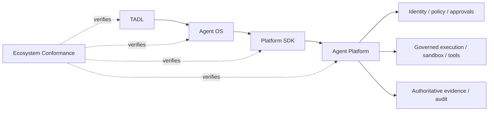

# Tinlance Agent Ecosystem Conformance

Agent Platform is the authoritative target of the cross-repository conformance gate.

## Platform obligations

The conformance gate verifies that the Platform:

- exposes API 1.1 at POST /v1/agent-platform;
- binds requests to the authenticated tenant and subject;
- fails closed on API-version or principal mismatch;
- enforces idempotency for guarded consequential operations;
- preserves trace and request metadata at the boundary; and
- remains the sole consequential authority plane.

The TADL repository pins reviewed commits for all four repositories and runs the executable suite against the reference HTTP boundary. The suite complements Platform CI, CodeQL, Scorecard, secret scanning, enterprise conformance, and release assurance.

## Production boundary

The reference HTTP server is a contract test boundary. Passing conformance does not claim that production PostgreSQL, external secret management, hardened TLS/token verification, sandbox infrastructure, enterprise identity, telemetry, backups, or incident response are deployed.

## Authority invariant

TADL declarations, Agent OS intent, SDK requests, model output, memory, retrieved content, tool output, and external responses never grant authority. The Platform decides whether a consequential operation may occur and produces authoritative evidence.