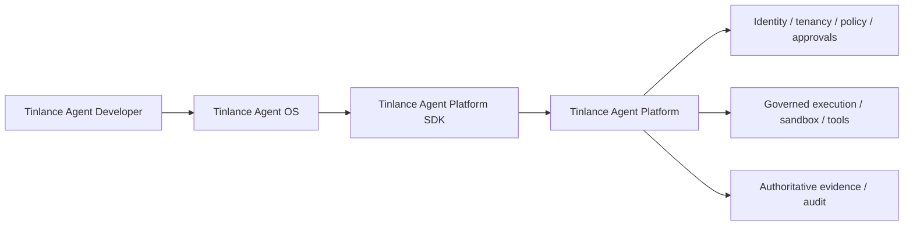

# Tinlance Agent Ecosystem Integration

Tinlance Agent Platform is the authoritative execution/authority plane beneath the other three repositories.

The Platform does not depend on TADL, Agent OS, or the SDK for authority. They are consumers of the Platform's versioned contracts. The Platform SDK is a developer transport surface; Agent OS is a higher-level lifecycle/control plane; TADL is a developer artifact plane.

**Canonical wire contract:** API version 1.1, `POST /v1/agent-platform`, with `governed-execution.v1` for consequential tool mediation.

The integration boundary binds tenant and subject to the authenticated principal, re-checks authorization at the consequential side-effect boundary, enforces idempotency for guarded operations, and emits authoritative evidence/events. Untrusted model/tool/external content never becomes authority merely by crossing an upstream layer.

The repository's HTTP server is a reference contract boundary. Production deployments must add the hardened TLS, token verification, durable persistence, secrets, isolated runtime, telemetry, and operational controls described by the production documentation.

The four-repository integration gate is maintained from the TADL repository and uses pinned commit SHAs so compatibility is reproducible rather than dependent on moving branches.
