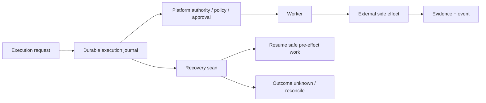

# M13.1 — Durable Agent Runtime

This is the first phase of the Tinlance ecosystem production-runtime sequence. It is an ecosystem program milestone, not a replacement for the Platform repository's canonical M0–M14 vocabulary.

## Objective

Make consequential execution state survive process restart without silently replaying an external side effect.

## Guarantees

- Execution identity and idempotency fingerprint are persisted before governed execution.
- Terminal results can be replayed after process restart.
- In-flight work that may have crossed the side-effect boundary is never blindly replayed.
- A monotonic side-effect marker distinguishes safe recovery from reconciliation-required work.
- The journal is tenant-scoped and uniquely keyed by `(tenant_id, idempotency_key)`.
- SQLite is a deterministic single-host reference adapter using WAL and `synchronous=FULL`.
- Production deployments must implement the same contract over the durable PostgreSQL boundary.

The design follows the durable-execution principle that state is reconstructed from durable history after failure, while external side effects remain at-least-once and require idempotency/reconciliation rather than a false exactly-once claim.

## Security boundary

The journal stores execution identity, fingerprints, state and result metadata; it does not persist raw execution input. Secrets and untrusted model/tool content therefore do not become durable workflow state merely because an execution is journaled.

## Acceptance gate

1. Journal persistence/reopen tests are green.
2. Terminal replay is proven.
3. Side-effect uncertainty is fail-closed.
4. Tenant/idempotency isolation is tested.
5. Platform CI, CodeQL, secret scanning and repository security gates are green.
6. Documentation and architecture flowcharts agree with the implementation.

## Explicit non-claim

This does not claim multi-host PostgreSQL HA, queue durability, backup/restore, distributed worker fencing or production sandbox infrastructure. Those are subsequent runtime/infrastructure acceptance gates.