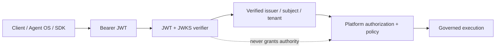

# M13.2 — Production Identity and Authentication

This phase adds a real cryptographic identity adapter to the governed Platform boundary. It does not move authorization into the identity layer.

## Verification profile

- JWKS-backed public-key verification through PyJWT.
- HTTPS is mandatory for issuer and JWKS endpoints.
- Allowed algorithms are explicit: RS256, PS256, ES256 and EdDSA; the token cannot select the allowed set.
- Issuer and audience are validated cryptographically and semantically.
- `exp`, `iat`, `iss`, `sub` and `jti` are required.
- Tenant identity is required from `tenant_id` or `tid`.
- Optional nonce binding prevents token substitution across authentication transactions.
- Optional explicit `typ` prevents cross-JWT profile confusion.
- JWKS key rotation is delegated to the provider's cached key client rather than trusting token-supplied URLs.

These controls follow current JWT best practices: fixed algorithm allowlists, issuer/subject validation, audience validation, explicit typing where profiles need separation, and no trust in attacker-controlled key URLs.

## Authority boundary

A verified identity is still only an authenticated principal. It does not grant a capability, bypass policy, approve an action, or widen tenant scope. Authorization remains a separate Platform decision.

## Production boundary

The verifier is the cryptographic adapter. Production deployments still require an approved identity provider, hardened JWKS availability, key lifecycle/revocation operations, TLS trust configuration, monitoring, and incident response.