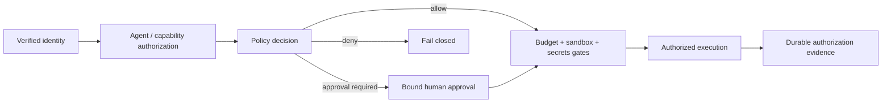

# M13.3 — Authorization and Policy Enforcement

Authentication establishes who the caller is. This phase proves that identity never becomes execution authority without an explicit Platform authorization decision and, when required, a bound human approval.

## Enforcement guarantees

- Capability authorization occurs before policy approval and before side effects.
- Policy denial cannot be overridden by model output or client assertions.
- A required approval must be approved for the exact tenant, run, action, resource and intent fingerprint.
- Supplying an unrelated approval ID cannot satisfy an approval gate.
- The durable execution journal records the policy decision identity at authorization.
- Budgets, sandbox and secret gates remain downstream constraints; none can grant authority.

## Authority equation

`effective authority = authenticated principal ∩ registered capability ∩ policy decision ∩ required approval ∩ runtime controls`

Any missing or mismatched term produces a fail-closed outcome.