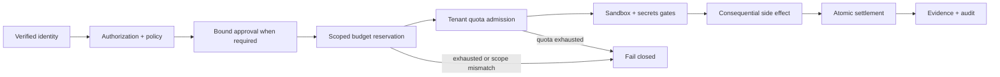

# M13.4 — Budget and Resource Governance

M13.4 hardens the consequential execution budget seam. A budget reservation is bound to the exact tenant, agent, run, action and resource scope before a side effect.

## Invariants

- Tenant and run ownership are immutable.
- A reservation carries agent, run, action and resource scope.
- Reservation IDs are idempotent: replay with a different scope is rejected.
- Reservation admission and quota accounting are serialized atomically in the reference implementation.
- Settlement consumes a reservation exactly once; release returns unconsumed admission.
- Quota controls constrain execution but never grant authorization.
- Budget denial occurs before the governed side effect.
- The Platform execution boundary is the only consumer that can turn a scoped reservation into consequential execution.

The reference quota ledger is intentionally in-process. Production deployments must provide a transactional shared store/lease strategy so the same invariants hold across workers and regions.
