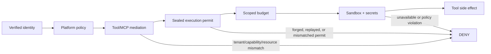

# M13.5 — Sandbox and Tool/MCP Authority

M13.5 hardens the execution-side mediation boundary so a policy decision by itself is not sufficient to invoke a consequential tool.

## Tool authority invariants

- Tool registrations are immutable.
- Every consequential ToolGateway execution requires a Platform-issued permit.
- Permits are sealed to the gateway instance, exact tenant/run/tool/action/resource scope, and a unique permit identity.
- Permits are single-use.
- A REQUIRE_AUTHORIZATION decision without an explicit approval requirement fails closed.
- Approval binding remains checked against the exact execution intent.
- Execution obtains the permit only after Platform policy evaluation and compares the permit decision with the authoritative policy result.

## MCP invariants

- MCP calls re-authorize the tool on every call.
- Tenant, capability, action and resource scope are checked before transport invocation.
- Arguments remain bounded by depth, count and string-size limits.
- Approval verification can be bound to the exact governed execution fingerprint.

## Sandbox invariants

- Required sandbox execution fails closed when the provider is unavailable.
- Bubblewrap uses namespace isolation and drops Linux capabilities.
- CPU, address-space, file-size and process-count ceilings are enforced by the executor.
- Workspace paths are absolute and traversal-free; production deployments must additionally bind them to an approved workspace authority/root.

These controls are aligned with current MCP security guidance emphasizing per-request authorization, audience-scoped credentials, isolation gateways and auditability. OWASP's MCP Top 10 specifically calls out privilege scope creep, tool poisoning, command execution, insufficient authorization, shadow servers and context over-sharing as major classes.
