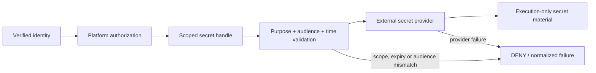

# M13.6 — Secrets and Credential Governance

M13.6 hardens the secret boundary without moving secret storage into the Platform kernel.

## Invariants

- Secret handles are immutable and versioned.
- Handles are bound to tenant, principal, agent, execution and capability.
- Handles additionally bind purpose and audience.
- Handles have explicit timezone-aware validity windows and fail closed outside them.
- The Platform does not store provider secret material.
- Provider failures do not expose backend or credential details through the Platform exception.
- Production providers must implement rotation, revocation, KMS/HSM protection, access logging and durable policy enforcement.
- Secret values must not be copied into model context, ordinary logs, telemetry attributes, evidence payloads or client-visible errors.

## External security alignment

RFC 9700 recommends least-privilege, audience-restricted credentials and sender-constrained access tokens where applicable. OWASP's MCP Top 10 identifies token/secret exposure and scope creep as primary MCP risks. These controls therefore treat audience, purpose, scope and lifetime as first-class authorization dimensions. 

Repository CI proves the contract and adversarial tests; it does not claim that an external secret manager or KMS has been deployed.
