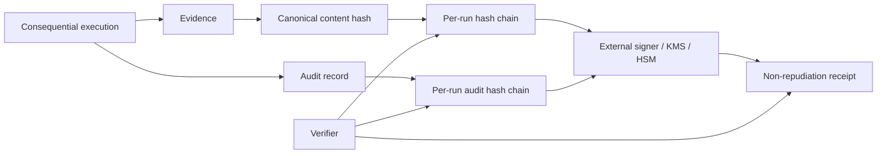

# M13.7 — Evidence, Audit and Non-Repudiation

M13.7 makes consequential execution records attributable, tamper-evident and externally attestable.

## Invariants

- Evidence and audit are distinct from ordinary telemetry.
- Tenant and run scope are immutable.
- Evidence records carry actor, execution, provenance and timestamp metadata.
- Each record commits to the previous record hash, making deletion/reordering/tampering detectable.
- Audit records capture actor, action, resource and decision without storing secret material.
- External signing is provider-neutral and can be backed by KMS/HSM.
- Verification fails closed when a chain or attestation does not validate.
- Repository implementations are reference adapters; durable append-only storage, WORM/retention controls and production key custody remain deployment responsibilities.

NIST's 2026 software-agent identity work explicitly highlights authorization, auditing and non-repudiation, while OWASP's MCP Top 10 calls out lack of audit and telemetry as a security risk. 
