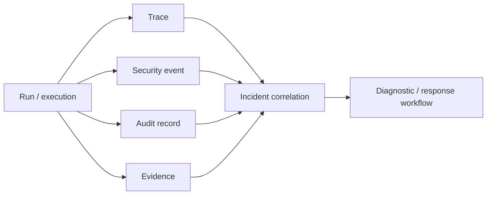

# M13.8 — Observability and Incident Correlation

M13.8 makes security-relevant telemetry causally useful without turning telemetry into authority.

## Invariants

- Tenant, run and execution identity remain correlation metadata, never authorization.
- Trace spans require normalized tenant/name and valid time ordering.
- Security events support trace, run, execution and incident correlation.
- Security events contain outcomes (allow, deny, error, unknown) and severity.
- Incident correlation groups identifiers rather than copying sensitive payloads.
- Telemetry must not contain secret material, bearer tokens, private keys or raw credential values.
- Production adapters should emit OpenTelemetry-compatible traces/metrics/logs and preserve W3C trace context at trust boundaries.
- Trace identifiers are normalized to W3C trace/span identifier formats before correlation.
- Incident correlation requires tenant binding for security events, audit records and evidence links; cross-tenant correlation fails closed.
- SLO/error-budget measurement remains operational governance and never grants execution authority.

The controls directly address OWASP MCP Top 10 MCP08 (lack of audit/telemetry) and NIST's agent-security emphasis on attributable auditing.
