# Production Runtime Hardening

This index covers the supplemental production-runtime hardening sequence. These labels do **not** replace the canonical M0–M14 roadmap; M15–M29 remain the post-M14 enterprise assurance sequence.

| Phase | Boundary | Primary acceptance |
|---|---|---|
| M13.1 | Durable execution | crash-safe journal, recovery, terminal-state integrity |
| M13.2 | Real identity | JWT/JWKS verification, issuer/audience/tenant/nonce validation |
| M13.3 | Authorization enforcement | capability + policy + exact approval binding before side effects |
| M13.4 | Budget/resource governance | atomic scoped reservation, exhaustion and replay safety |
| M13.5 | Sandbox/tool/MCP authority | Platform-issued single-use permits, sandbox isolation and MCP mediation |
| M13.6 | Secrets/credential governance | execution-scoped, purpose/audience/time-bound handles; unscoped resolution fails closed |
| M13.7 | Evidence/audit/non-repudiation | hash chains, execution/intent binding and cryptographic attestation |
| M13.8 | Observability/incident correlation | W3C correlation identifiers and tenant-bound incident links |

## Canonical authority path

```mermaid
flowchart LR
    I[Verified identity] --> A[Authorization / policy]
    A --> R[Risk / approval]
    R --> B[Budget / resource governance]
    B --> T[Tool / MCP mediation]
    T --> S[Sandbox / secrets]
    S --> X[Consequential execution]
    X --> E[Evidence / audit]
    E --> O[Observability / incident correlation]
    D[Agent Developer / TADL] --> OS[Agent OS]
    OS --> SDK[Platform SDK]
    SDK --> P[Agent Platform]
    P --> I
```

## Security invariants

- No upstream repository grants consequential authority.
- Authentication is not authorization.
- Capability declarations are not execution authority.
- Required approval is bound to the exact intent and remains independently validated.
- Budget, sandbox, tool, MCP and secret controls are fail-closed.
- Secrets are execution-only handles and are never ordinary evidence/telemetry.
- Evidence and audit are independently integrity-verifiable and tenant-scoped.
- Telemetry is correlation data, never authority.
- Repository CI demonstrates repository controls; production deployment still requires external infrastructure and operational evidence.

## External alignment

The controls are informed by NIST's 2026 software-agent identity/authorization work, OWASP agentic-security guidance, and OAuth 2.0 Security BCP (RFC 9700). These sources inform the design but do not substitute for executable tests or deployment evidence.
